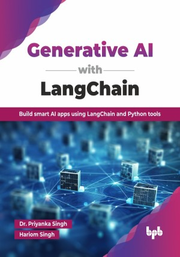

# Generative AI with LangChain

Build smart AI apps using LangChain and Python tools.

This is the repository for [Generative AI with LangChain
](https://bpbonline.com/products/generative-ai-with-langchain?_pos=1&_sid=4c6a1d5fa&_ss=r&variant=44604899328200),published by BPB Publications.

## About the Book
AI is redefining how businesses solve problems, automate decisions, and deliver value. LangChain, an emerging framework, streamlines the integration of large language models into real-world applications, making AI more actionable and accessible. Unlock the power of cutting-edge AI with LangChain, a revolutionary Python framework designed to simplify the creation of sophisticated AI applications. 

This book begins with the foundational knowledge of AI and LangChain, followed by practical tools like Python, neural networks, and cloud platforms such as AWS and Azure. You will explore LangChain’s architecture and gain hands-on experience integrating LangChain with leading cloud platforms. You will discover how to leverage powerful data science tools like Snowflake and Athena for real-world AI projects. You will analyze AI applications in modern operational frameworks, such as DevOps and MLOps, and gain insights into the exciting future trends, ethical AI practices, and real-world deployment strategies that are shaping the evolution of AI and LangChain.

By the end of this book, readers will confidently design, develop, and deploy intelligent AI applications using LangChain. You will be equipped to solve real-world problems through scalable, cloud-integrated AI systems with strong coding, deployment, and data-handling skills.

## What You Will Learn
• Understand AI fundamentals, LangChain's architecture, ethical AI, and Python setup.

• Master Python basics, control structures, functions, and modules for AI development.

• Explore LangChain's core components, workflow, and practical implementation in AI.

• Apply AI, including LangChain, in DevOps and MLOps for automation and efficiency.

• Explore future AI trends, LangChain's evolving role, and ethical considerations.

• Integrate LangChain with AWS services for scalable AI deployment and management.

• Utilize Snowflake and Athena with LangChain for real-world data-driven AI projects.

